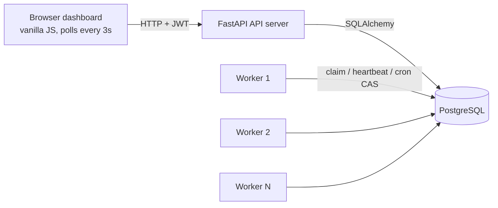

Architecture

Components

API server (app/) — stateless FastAPI process. Owns the public REST
surface: auth (JWT), organizations/projects/queues CRUD, job submission
(immediate / delayed / batch / cron templates), job inspection, DLQ
management, metrics. Also serves the static dashboard. Can be scaled
horizontally behind a load balancer because it keeps no in-process state.

Worker service (worker/) — a separate process (python -m worker.main),
deliberately not an API endpoint. Each worker:

- polls for due jobs every second and claims them atomically (see below)
- executes up to WORKER_CONCURRENCY jobs in a thread pool
- heartbeats every 5s (workers.last_heartbeat_at + a worker_heartbeats row)
- runs a maintenance tick every 2s: cron materialization + dead-worker reaping
- on SIGTERM/SIGINT: stops claiming, drains running jobs (up to 25s), then
  marks itself offline

PostgreSQL — the single coordination point. Workers share no state and
never communicate with each other or with the API; every guarantee
(single execution, exactly-once cron, crash recovery) is enforced with
database primitives (row locks, compare-and-set updates, constraints).

Why coordinate through the database (and not a message broker)?

A broker (Redis/RabbitMQ) is the classic answer, but it adds a second
stateful system and — crucially — splits the source of truth: the broker
knows the queue, the DB knows the history, and keeping them consistent
requires careful two-phase logic. At this project's scale, PostgreSQL's row
locking (FOR UPDATE SKIP LOCKED) gives correct, contention-free claiming
with one source of truth, transactional state transitions, and free
auditability. The claiming logic is isolated in app/services/claiming.py,
so swapping in a broker later would not touch the API or the handlers.

Data flow: life of a job

1. POST /api/v1/queues/{id}/jobs — validated, written as a jobs row
   (queued, or scheduled if run_at/delay_s puts it in the future).
2. A worker's poll promotes due scheduled rows, then claims up to its free
   capacity, honoring queue priority and per-queue concurrency limits.
3. The runner opens a job_executions row (attempt N), flips the job to
   running, and dispatches to the registered handler. Handler log lines
   land in job_logs tied to that execution.
4. Success → completed (+ result JSON). Failure → attempts++, and either
   requeued with a backoff delay (run_at = now + backoff) or, once
   attempts >= max_attempts, moved to dead with a dead_letter_jobs snapshot.
5. The dashboard polls the read APIs and renders all of this live.

Concurrency control, in one place each

| Problem | Mechanism | Where |
|---|---|---|
| Two workers claim the same job | FOR UPDATE SKIP LOCKED (PG) / CAS update + rowcount (SQLite) | services/claiming.py |
| Queue concurrency limit | claim capped at limit − active counted in the claim transaction | services/claiming.py |
| Cron fires once, not once per worker | CAS on scheduled_jobs.next_run_at | services/cron.py |
| Worker dies mid-job | heartbeat staleness → reaper requeues orphans | services/lifecycle.py |
| Client retries a create request | unique (queue_id, idempotency_key) + return-existing | routers/jobs.py |

Scaling story

- Workers: purely horizontal — docker compose up --scale worker=N.
  SKIP LOCKED means more workers never block each other on the claim query.
- API: stateless; N replicas behind a load balancer.
- Database: the eventual bottleneck. Mitigations in order: the composite
  claim index (already present), partitioning jobs by status/time,
  archiving completed jobs, then queue sharding across databases (the
  queue_id foreign key is the natural shard key).
