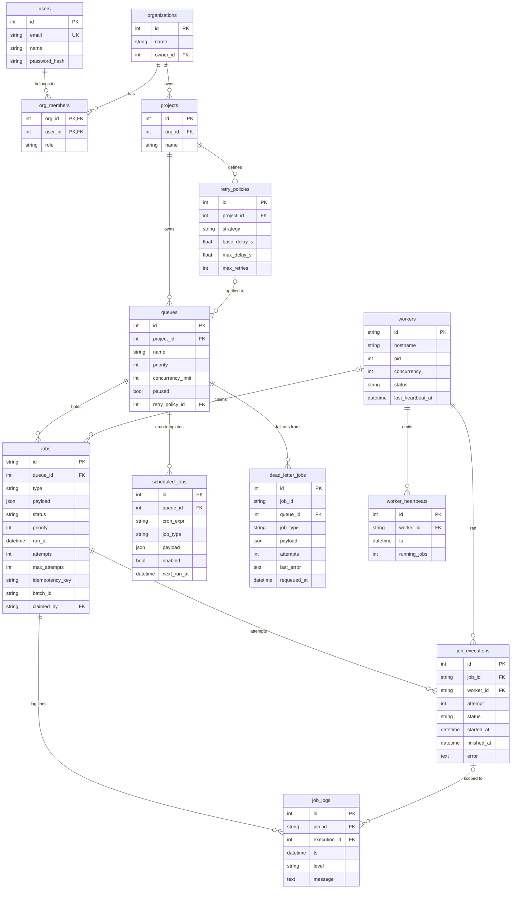

ER Diagram and Schema Reasoning

Keys

- Integer PKs for low-volume, human-managed entities (users, orgs,
  projects, queues, policies).
- UUID string PKs for jobs and workers: created at high rate,
  potentially from many API replicas — UUIDs avoid coordinating a sequence,
  are safe to expose in URLs (non-guessable, non-enumerable), and remain
  unique if queues are ever sharded across databases.

Normalization

Third normal form throughout, with two deliberate denormalizations:

1. dead_letter_jobs snapshots job_type/payload instead of only
   referencing jobs — the DLQ must survive job-row archival and be
   independently auditable.
2. jobs.attempts is a counter even though it equals COUNT(job_executions) —
   the claim path filters on it constantly and must not pay a join/aggregate per poll.

Cascade behavior

- Org → projects → queues → jobs → executions/logs: ON DELETE CASCADE —
  deleting a tenant cleanly removes their tree.
- queues.retry_policy_id and jobs.claimed_by: ON DELETE SET NULL — a
  deleted policy or worker must not delete jobs; the queue falls back to the
  default policy, the job gets requeued by the reaper.

Indexes (the ones that matter)

| Index | Serves |
|---|---|
| ix_jobs_claim (queue_id, status, run_at, priority) | the hot claim query — every worker, every second |
| uq_jobs_idempotency (queue_id, idempotency_key) | duplicate-create prevention, enforced by the DB not the app |
| ix_jobs_batch (batch_id) | batch listing |
| ix_job_logs_job_ts (job_id, ts) | job detail view (logs in order) |
| ix_sched_due (enabled, next_run_at) | cron tick scans only enabled+due rows |
| workers.last_heartbeat_at | reaper's staleness scan |
